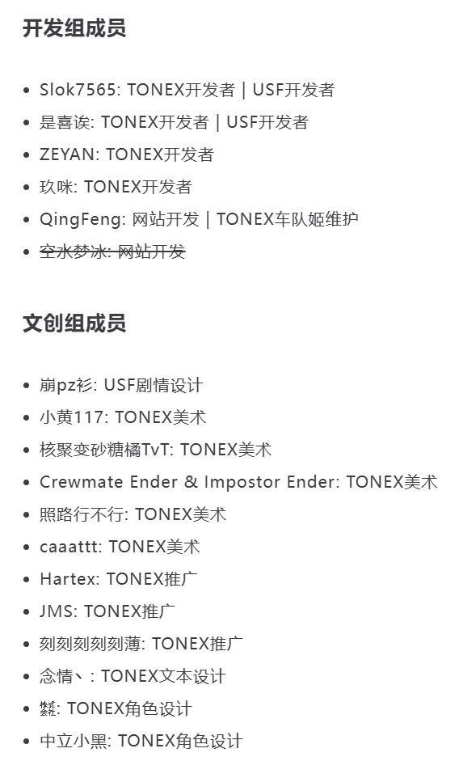

<h3><strong>XtremeWave,Among Us Mod出色贡献者。</strong></h3>
<a href="https://www.xtreme.net.cn" target="_blank">XtremeWave官方网站</a> | [XtremeWave Github] | <a href="https://gitee.com/TEAM_TONEX" target="_blank">XtremeWave Gitee</a>

## 关于我们
XtremeWave是一支专注于游戏开发和技术创新的团队，致力于为玩家提供高质量的游戏体验。 
我们在GitHub上有多个开源项目，例如TownOfNewEpic_Xtreme。 
XtremeWave使用现代技术栈如TypeScript和VuePress来开发和维护他们的网站和服务。

## XtremeWave成员

## 赞助我们
请访问[XtremeWave官方网站](https://www.xtreme.net.cn/donate)。
## 加入我们
请访问[XtremeWave官方网站](https://www.xtreme.net.cn/933187.html)。
> 请注意: 
> XtremeWave是一个以提升个人能力为目的,以热爱为动力的合法无偿组织,如果您为了收取利益而加入,那么我们可能会让您失望,我们所有的收入皆需要玩家赞助。 
> 或许开发者会偶尔发发红包,但请您确保在真正不为了收入,而是为了XtremeWave的前提下再作申请。 
> 如果您真的愿意加入我们,请您更多的为XtremeWave做出贡献,不恶意抹黑、诋毁、侮辱XtremeWave的项目与成员、不随意向外散布XtremeWave制作组群聊的消息。
